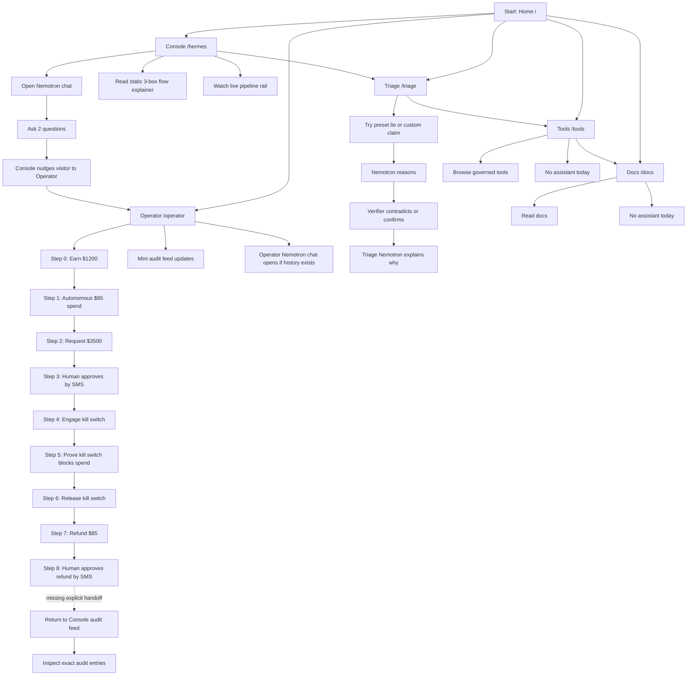
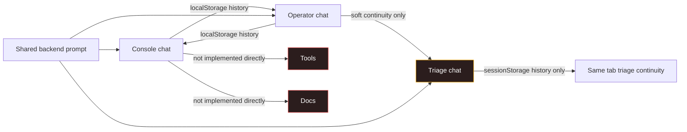
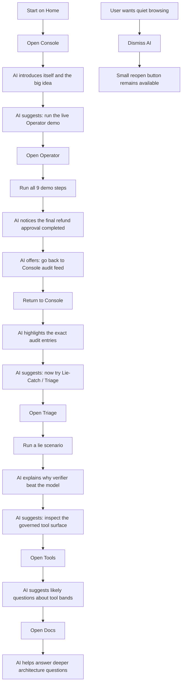

# Custodian Site Flowchart

_Last updated: 2026-06-30_

This is the current user-facing flow as the codebase implements it today, plus the intended guided path you described.

## Current user journey

## Assistant continuity today

## What is working now

1. The console is the strongest guided experience.
2. The console assistant can push people into the operator panel.
3. The operator panel preserves conversation history from the console.
4. The operator panel has a live mini audit feed, so the user can see something updating while they run steps.
5. The triage page has its own assistant and can explain lie-catch behavior.

## Where the flow breaks now

1. The “flow chart” on the console explains architecture, not the full site journey.
2. After the operator refund flow finishes, the AI does not explicitly say “go back to the console audit feed now.”
3. The operator assistant is not event-aware. It does not react to step completion with contextual next-step guidance.
4. Triage uses `sessionStorage` for history while console/operator use `localStorage`, so continuity is inconsistent.
5. Tools and docs have no assistant layer, so the guided journey stops there.
6. There is no single persistent assistant shell shared across all pages.

## Intended guided path

## Short version

If you want the site to feel coherent, the assistant should own this exact sequence:

1. `Home -> Console`
2. `Console -> Operator`
3. `Operator -> Console audit`
4. `Console audit -> Triage`
5. `Triage -> Tools`
6. `Tools -> Docs`

And the assistant should be dismissible, not mandatory.

