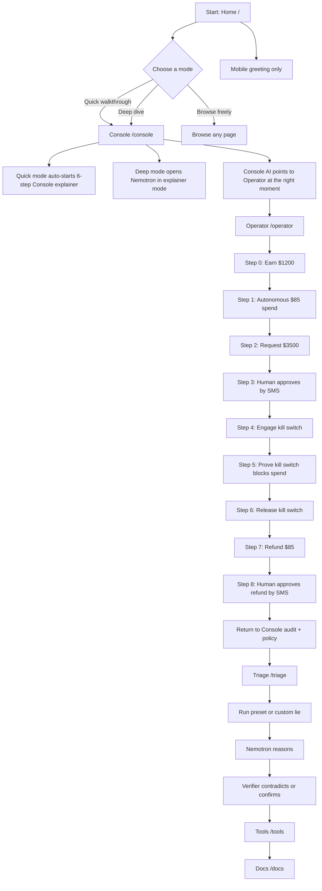
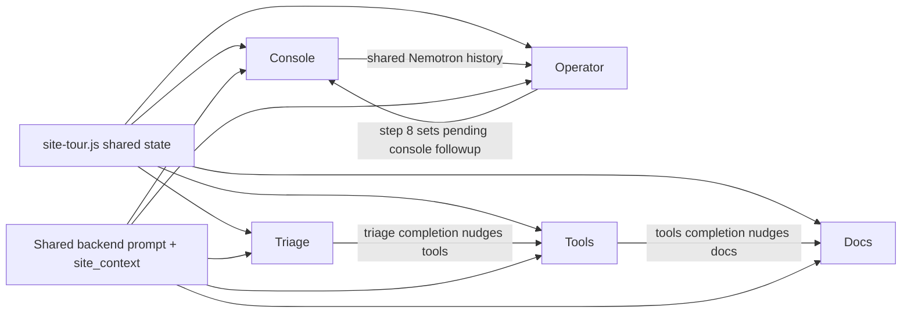
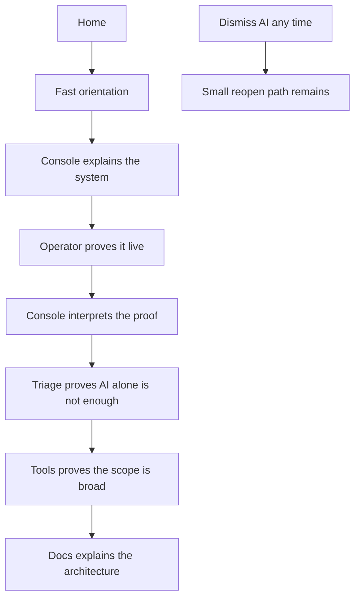

# Custodian Site Flowchart

_Last updated: 2026-06-30_

This is the current user-facing flow as the codebase implements it today, plus the intended guided path you described.

## Implemented user journey

## Assistant continuity now

## What is working now

1. Home now offers `Quick walkthrough`, `Deep dive`, and `Browse freely`.
2. Mobile does not auto-open a blocking assistant panel.
3. Console and operator share state and chat history.
4. Operator step completion now hands the user back to the console audit.
5. Triage, tools, and docs are part of the same guided path.
6. Tools and docs now include lightweight guide copy instead of a dead-end surface.

## Desired story the site now tells

## Short version

If you want the site to feel coherent, the assistant should own this exact sequence:

1. `Home -> Console`
2. `Console -> Operator`
3. `Operator -> Console audit`
4. `Console audit -> Triage`
5. `Triage -> Tools`
6. `Tools -> Docs`

And the assistant should be dismissible, not mandatory.
